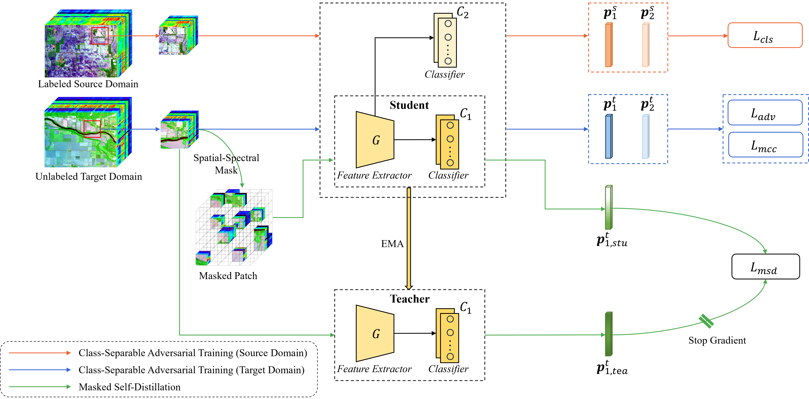

# MSDA-2024
This is a code demo for the paper "_Masked Self-Distillation Domain Adaptation for Hyperspectral Image Classification_" in IEEE TGRS 2024.

## Abstract
Deep learning-based unsupervised domain adaptation (UDA) has shown potential in cross-scene hyperspectral image (HSI) classification.
However, existing methods often experience reduced feature discriminability during domain alignment due to the difficulty of extracting semantic information from unlabeled target domain data.
This challenge is exacerbated by ambiguous categories with similar material compositions and the underutilization of target domain samples.
To address these issues, we propose a novel masked self-distillation domain adaptation (MSDA) framework, which enhances feature discriminability by integrating masked self-distillation (MSD) into domain adaptation. A class-separable adversarial training (CSAT) module is introduced to prevent misclassification between ambiguous categories by decreasing class correlation.
Simultaneously, CSAT reduces the discrepancy between source and target domains through biclassifier adversarial training.
Furthermore, the MSD module performs a pretext task on target domain samples to extract class-relevant knowledge. Specifically, MSD enforces consistency between outputs generated from masked target images, where spatial-spectral portions of an HSI patch are randomly obscured, and predictions produced based on the complete patches by an exponential moving average teacher.
By minimizing consistency loss, the network learns to associate categorical semantics with unmasked regions.
Notably, MSD is tailored for HSI data by preserving the samples' central pixel and the object to be classified, thus maintaining class information.
Consequently, MSDA extracts highly discriminative features by improving class separability and learning class-relevant knowledge, ultimately enhancing UDA performance.
Experimental results on four datasets demonstrate that MSDA surpasses the existing state-of-the-art unsupervised domain adaptation methods for HSI classification. The code is available at https://github.com/Li-ZK/MSDA-2024 .

## Overview


## Requirements
You can obtain the docker image via https://hub.docker.com/r/he97/hsi_exp_env/tags

## Datasets

The hyperspectral datasets in MAT format can be downloaded from one of the following sources:

+ Figshare

Link: https://doi.org/10.6084/m9.figshare.26761831

+ BaiduYun

Link: https://pan.baidu.com/s/1jnn8N38GF6lNB18fejlvlg?pwd=13g8 Password: 13g8

+ OneDrive

Link: https://saueducn-my.sharepoint.com/:f:/g/personal/fangzhuoqun_sau_edu_cn/Eksc3Z9UJMpKvxWwx42aPKYB9rvoSxniyBNph5FyD-vnyA?e=SK93Gc Password: x893

The downloaded files should be moved to `./data` folder. An example dataset folder has the following structure:

```
data
├── Houston
│   ├── Houston13.mat
│   └── Houston13_7gt.mat
│   ├── Houston18.mat
│   └── Houston18_7gt.mat
├── Pavia
│   ├── paviaU.mat
│   └── paviaU_gt_7.mat
│   ├── pavia.mat
│   └── pavia_gt_7.mat
├── Houston2013
│   ├── data.mat
│   └── mask_test.mat
│   ├── mask_train.mat
├── HyRANK
│   ├── Dioni_gt_out68.mat
│   └── Dioni.mat
│   ├── Loukia_gt_out68.mat
│   ├── Loukia.mat
├── YRD
│   ├── yrd_nc12_7gt.mat
│   └── yrd_nc12.mat
│   ├── yrd_nc13_7gt.mat
│   ├── yrd_nc13.mat
```

## Usage:
Take MSDA method on the UP2PC task as an example: 
1. Open a terminal or put it into a pycharm project. 
2. Put the dataset into the correct path. 
3. Run up2pc.py.

## Citation
If you found our project helpful, please kindly cite our paper:

Zhuoqun Fang, Wenqiang He, Zhaokui Li, Qian Du and Qiusheng Chen. Masked Self-Distillation Domain Adaptation for Hyperspectral Image Classification. IEEE Transactions on Geoscience and Remote Sensing, vol. 62, pp. 1-20, 2024, Art no. 5525720. DOI: 10.1109/TGRS.2024.3436814.

```
@ARTICLE{10620320,
  author={Fang, Zhuoqun and He, Wenqiang and Li, Zhaokui and Du, Qian and Chen, Qiusheng},
  journal={IEEE Transactions on Geoscience and Remote Sensing}, 
  title={Masked Self-Distillation Domain Adaptation for Hyperspectral Image Classification}, 
  year={2024},
  volume={62},
  number={},
  pages={1-20},
  keywords={Feature extraction;Training;Task analysis;Data models;Data mining;Adaptation models;Correlation;Classification;hyperspectral image (HSI);knowledge distillation;masked image modeling (MIM);unsupervised domain adaptation (UDA)},
  doi={10.1109/TGRS.2024.3436814}}
```
